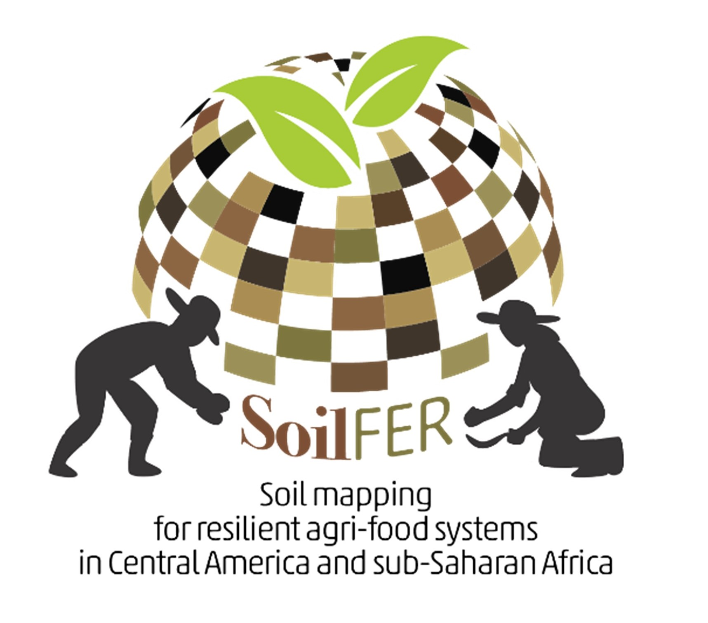

<table style="width: 100%;">
  <tr>
    <td style="text-align: left; vertical-align: top; width: 75%;">
      <h1>SoilFER</h1>
      
<em>“Soil Mapping for Resilient Agrifood Systems in Central America and Sub-Saharan Africa”</em>

      
SoilFER stands out as a unique framework aimed at unearthing valuable information from soils to guide policymaking and fertilizer recommendations both at national and field scale.

    </td>
    <td style="text-align: right; vertical-align: top; width: 25%;">
      
    </td>
  </tr>
</table>

## Folders

The **sampling design folder** includes scripts for implementing soil sampling designs applicable to any country within the SoilFER project framework. To support training sessions, the folder also provides a practical case study based in Zambia, Africa.
