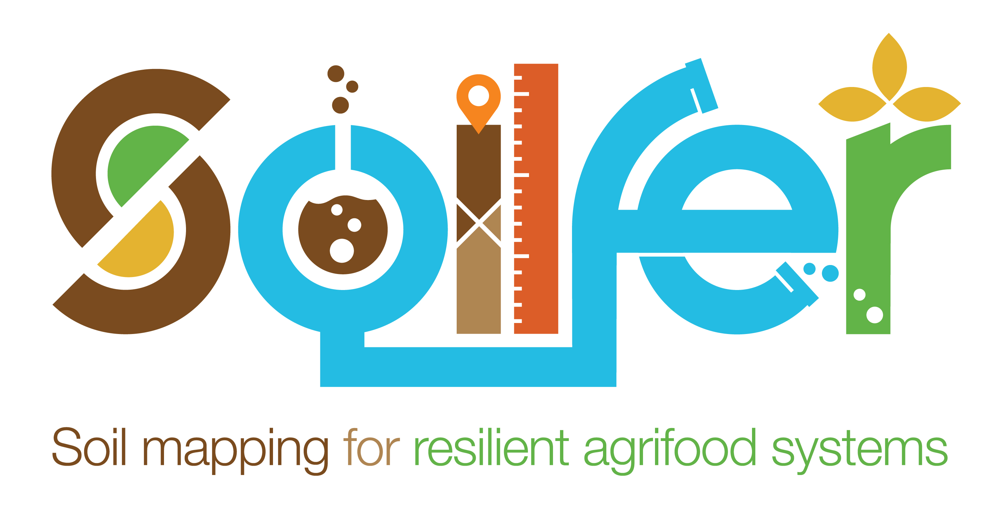

<table style="width: 100%;">
  <tr>
    <td style="text-align: left; vertical-align: middle; width: 70%;">
      <h1 style="margin-bottom: 0.3em;">SoilFER</h1>
      
<em>🌱 Soil Mapping for Resilient Agrifood Systems in Central America and Sub-Saharan Africa</em>

    </td>
    <td style="text-align: right; vertical-align: middle; width: 30%;">
      
    </td>
  </tr>
</table>

<table style="width: 100%;">
  <tr>
     
  </tr>
</table>

## 📘 Overview

**SoilFER** is a programme supporting **soil mapping for resilient agri-food systems** in **Central America** and **Sub-Saharan Africa**. By integrating robust sampling design, soil analysis, and mapping workflows, SoilFER supports evidence-based **policy formulation** and **fertilizer recommendations** at national and field scales.

## 🧭 What’s in this Repository?

- 🗺️ **Sampling design**  
  Scripts for implementing soil sampling designs adaptable to any country context within the SoilFER project framework.  
  To support training sessions, the folder also provides a practical case study based in **Zambia**.

- 🌾 **Crop suitability App**  
  Acess to source code of the **SoilFER CropSuit App**, a web-based decision-support tool designed to enhance agricultural planning through geospatial data integration, crop modeling, and suitability assessments and support decision-making and accessible at ➡️ https://data.apps.fao.org/soilfer/cropsuit.

